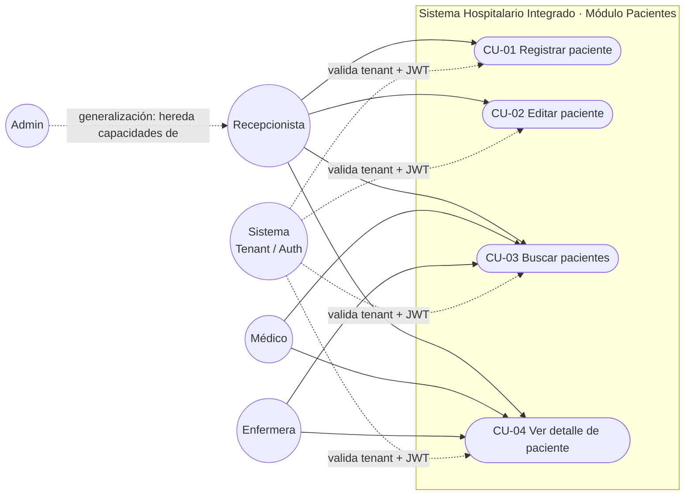

# Módulo 03 — Actores y casos de uso (Semana 1)

## Actores

| Actor | Tipo | Descripción |
|---|---|---|
| **Recepcionista** | Principal | Registra, edita y busca pacientes en la operación diaria del hospital. Rol por defecto al registrarse en el sistema. |
| **Admin** | Principal | Tiene las mismas capacidades que Recepcionista sobre pacientes, como parte de su rol administrativo dentro del tenant. |
| **Médico** | Secundario | Busca pacientes y consulta el detalle durante la atención clínica; no crea ni edita datos administrativos del paciente. |
| **Enfermera** | Secundario | Igual que Médico: solo lectura sobre búsqueda y detalle de paciente. |
| **Sistema (Tenant / Auth)** | Soporte | Middleware `tenant` y `jwt.auth` que valida `X-Tenant-ID` y el token JWT en cada operación, y aísla los datos por hospital.. |

## Narrativa de casos de uso

| # | Caso de uso | Actor(es) | Descripción breve |
|---|---|---|---|
| CU-01 | Registrar paciente | Recepcionista, Admin | Crea un nuevo registro de paciente con datos demográficos, contacto, dirección y seguro; el sistema genera un código único `PAC-0001` por tenant. |
| CU-02 | Editar paciente | Recepcionista, Admin | Actualiza los datos de un paciente ya existente (contacto, dirección, seguro, contacto de emergencia, etc.). |
| CU-03 | Buscar pacientes | Recepcionista, Admin, Médico, Enfermera | Busca pacientes por nombre, DPI o código; devuelve resultados paginados, acotados al tenant activo. |
| CU-04 | Ver detalle de paciente | Recepcionista, Admin, Médico, Enfermera | Muestra el registro completo del paciente junto con un resumen de su admisión actual (si existe), alergias registradas y referencia a su expediente médico. |

## Procesos

Flujo normal y flujo alterno de cada caso de uso. En todos los casos, el sistema valida primero `X-Tenant-ID` (middleware `tenant`) y el token JWT (middleware `jwt.auth`) antes de ejecutar la operación.

### CU-01 — Registrar paciente

**Flujo normal:**
1. Recepcionista o Admin abre el formulario de registro de paciente.
2. Ingresa datos demográficos, contacto, dirección y seguro.
3. El sistema valida tenant y JWT del usuario autenticado.
4. El sistema valida que el DPI (si se ingresó) no esté duplicado dentro del mismo tenant.
5. El sistema genera el código único correlativo por tenant (`PAC-0001`).
6. El sistema guarda el registro y confirma el alta.

**Flujo alterno:**
- DPI duplicado en el mismo tenant → el sistema rechaza el registro e indica el paciente existente.
- Datos obligatorios faltantes o inválidos → el sistema devuelve errores de validación por campo.

### CU-02 — Editar paciente

**Flujo normal:**
1. Recepcionista o Admin busca y selecciona un paciente existente.
2. Modifica los campos editables (contacto, dirección, seguro, contacto de emergencia, tipo de sangre, notas, etc.).
3. El sistema valida tenant, JWT y unicidad de DPI si el valor cambia.
4. El sistema guarda los cambios y confirma la actualización.

**Flujo alterno:**
- El paciente no pertenece al tenant activo → el sistema deniega el acceso.
- El nuevo DPI colisiona con otro paciente del mismo tenant → el sistema rechaza el cambio.

### CU-03 — Buscar pacientes

**Flujo normal:**
1. Recepcionista, Admin, Médico o Enfermera ingresa un término de búsqueda (nombre, DPI o código).
2. El sistema valida tenant y JWT.
3. El sistema filtra los pacientes del tenant activo que coincidan con el término.
4. El sistema devuelve resultados paginados.

**Flujo alterno:**
- Sin coincidencias → el sistema devuelve una lista vacía con indicación de "sin resultados".

### CU-04 — Ver detalle de paciente

**Flujo normal:**
1. Recepcionista, Admin, Médico o Enfermera selecciona un paciente desde el resultado de búsqueda.
2. El sistema valida tenant y JWT.
3. El sistema carga el registro completo del paciente.
4. El sistema agrega el resumen de la admisión activa (si existe), las alergias registradas y la referencia al expediente médico.

**Flujo alterno:**
- El paciente no existe o no pertenece al tenant activo → el sistema devuelve error 404.
- El paciente no tiene admisión activa → el resumen de admisión se omite sin generar error.

## Diagrama de casos de uso

Notas del diagrama:
- **Admin** se modela como generalización de **Recepcionista** (línea punteada): hereda sus 4 casos de uso sin duplicar las conexiones.
- **Sistema (Tenant / Auth)** es el actor de soporte de la tabla de actores; se conecta a los 4 casos de uso porque valida tenant y JWT antes de cualquier operación, sin ser quien las inicia.

## Alcance y límites

Ver [`narrativa-alcance.md`](./narrativa-alcance.md).
