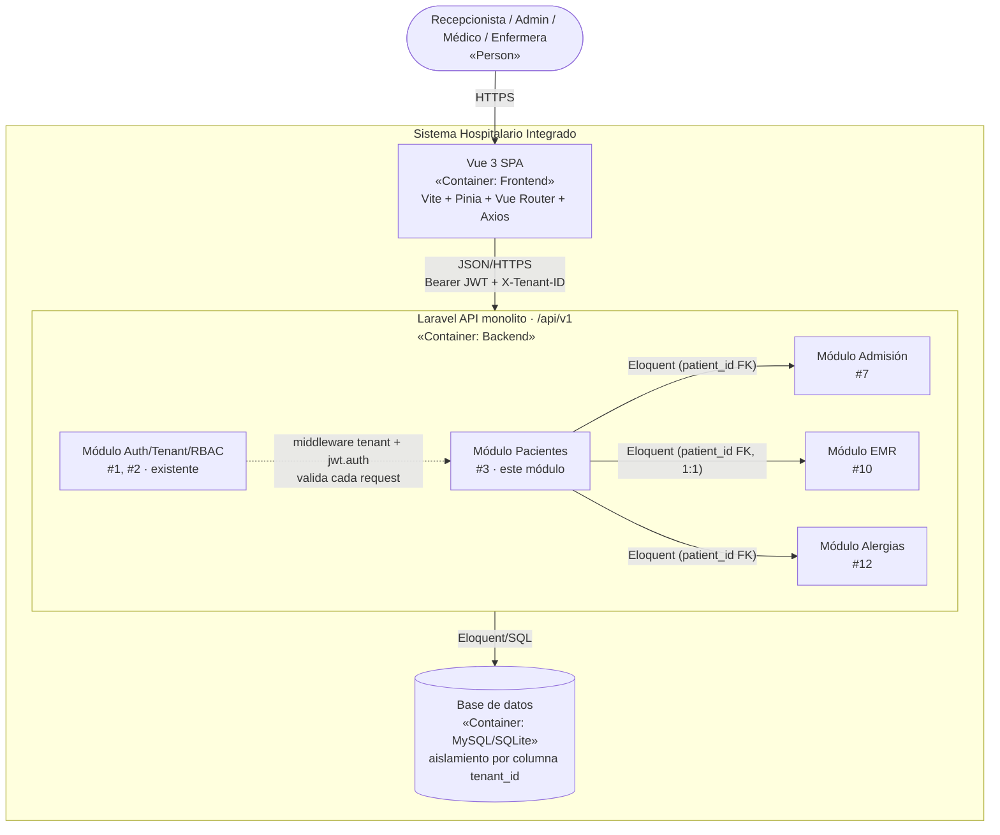
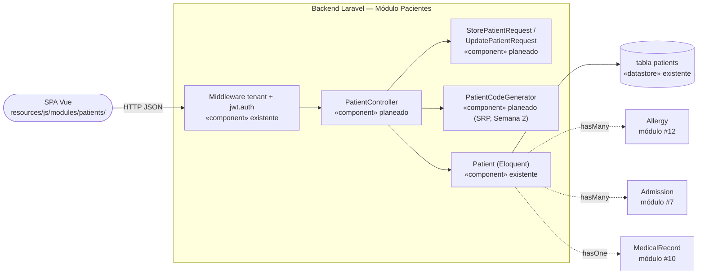

# Módulo 03 — Vista arquitectónica (Semana 3)

## 1. Estilo arquitectónico del HIS

El Sistema Hospitalario Integrado es un **monolito modular cliente-servidor**: una SPA Vue 3 consume una API REST expuesta por un backend Laravel 12, y cada módulo vertical (Pacientes, Admisión, EMR, Laboratorio, etc.) vive dentro del mismo backend, compartiendo una única base de datos con aislamiento **por columna `tenant_id`** (multi-tenancy de base de datos compartida, no de base de datos dedicada por tenant).

Patrones/estilos identificados que aplican al módulo Pacientes:

| Patrón | Dónde se ve en el módulo |
|---|---|
| Cliente-servidor | SPA Vue → API REST `/api/v1/patients*` (a implementar). |
| Middleware pipeline | `tenant` → `jwt.auth` se ejecutan en cadena antes de llegar al controller ([routes/api.php](../../routes/api.php)). |
| Multi-tenancy por discriminador | Todas las consultas de `patients` filtran por `tenant_id`; lo aplica [TenantMiddleware.php](../../app/Http/Middleware/TenantMiddleware.php) resolviendo el tenant desde `X-Tenant-ID` y [JwtAuth.php](../../app/Http/Middleware/JwtAuth.php) verificando que el tenant del token coincida. |
| Capas (planeado, ver Semana 2 SOLID) | Controller → Form Request → Servicio (`PatientCodeGenerator`) → Modelo Eloquent. |
| Módulos por carpeta en frontend | El patrón ya usado en `resources/js/modules/auth/` se replicará como `resources/js/modules/patients/`. |

## 2. Diagrama de contenedores (C4 Nivel 2) — el módulo dentro del HIS

## 3. Diagrama de componentes (C4 Nivel 3) — dentro del módulo Pacientes

## 4. Estado actual vs. planeado por componente

| Componente | Capa | Estado | Evidencia |
|---|---|---|---|
| `tenant` / `jwt.auth` (middleware) | Seguridad transversal | Existente | [TenantMiddleware.php](../../app/Http/Middleware/TenantMiddleware.php), [JwtAuth.php](../../app/Http/Middleware/JwtAuth.php) |
| `Patient` (modelo Eloquent) | Persistencia/dominio | Existente | [Patient.php](../../app/Models/Patient.php) |
| Tabla `patients` | Persistencia | Existente | [2026_04_26_100000_create_admission_catalogs.php](../../database/migrations/2026_04_26_100000_create_admission_catalogs.php) |
| `PatientController` | API/HTTP | Planeado | A construir en semanas de implementación |
| `StorePatientRequest` / `UpdatePatientRequest` | Validación | Planeado | A construir junto al controller |
| `PatientCodeGenerator` | Lógica de negocio | Planeado | Diseñado conceptualmente en [rf-rnf-solid.md](./rf-rnf-solid.md) (SRP) |
| `resources/js/modules/patients/` | Frontend | Planeado | Sigue el patrón ya usado en `resources/js/modules/auth/` |

## 5. Dependencias arquitectónicas con el HIS

| Módulo relacionado | Tipo de acoplamiento | Dirección | Responsabilidad de Pacientes |
|---|---|---|---|
| #1 Auth/Tenant | Middleware compartido (`tenant`, `jwt.auth`) | Entrada transversal | Exigir contexto autenticado y tenant válido; no administra seguridad. |
| #2 RBAC | Permisos/roles vía Spatie (a aplicar en el controller/policy) | Entrada transversal | Restringir escritura a Recepcionista/Admin y lectura a Médico/Enfermera. |
| #7 Admisión | FK `patients.id` ← `admissions.patient_id` | Pacientes → Admisión | Exponer `patient_id`; no crea ni gestiona admisiones. |
| #10 EMR (expediente) | FK `patients.id` ← `medical_records.patient_id` (1:1) | Pacientes → EMR | Exponer `patient_id`; no gestiona el expediente. |
| #12 Alergias | FK `patients.id` ← `allergies.patient_id` | Pacientes → Alergias | Exponer `patient_id`; no gestiona alergias clínicas. |

## 6. Decisiones y riesgos

- **Decisión:** mantener el aislamiento de tenant a nivel de columna (`tenant_id`) y no de base de datos separada, siguiendo el patrón ya usado por `wards`, `beds`, `specialties` y `doctors` en la misma migración base.
- **Decisión:** aplicar el patrón de capas (Controller → Request → Servicio → Modelo) definido en la Semana 2 al construir `PatientController`, para mantener SRP.
- **Riesgo:** el middleware `tenant` actual resuelve el tenant únicamente desde el header `X-Tenant-ID` sin cruzarlo con el usuario autenticado; es `jwt.auth` quien valida esa coincidencia. Si `PatientController` llega a usarse sin `jwt.auth` en alguna ruta, quedaría expuesto a fuga entre tenants.
- **Riesgo:** aún no existe policy de Spatie para `Patient`; se debe definir junto con el módulo #2 (RBAC) antes de habilitar escritura desde la API.
