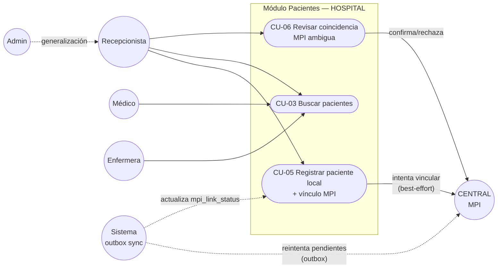

# Diagrama de casos de uso — Módulo 03

Acota al módulo (paciente local + vínculo MPI). Actores y CU-01..CU-04 heredados de
[`docs/module-03/actores-casos-de-uso.md`](../../module-03/actores-casos-de-uso.md);
CU-05 y CU-06 son nuevos de esta actividad.

## Notas

- **CU-05** siempre se completa aunque `Central` no responda (línea punteada de `Sync` representa el reintento posterior, no una dependencia dura).
- **CU-06** es la única forma de resolver una coincidencia ambigua: nunca ocurre automáticamente.
- Los cuatro roles y su generalización (Admin hereda de Recepcionista) se mantienen igual que en la semana 1.
