# Diagrama de clases de diseño — Módulo 03

Corresponde a nombres reales del código (`app/Domain/Patients`, `app/Application/Patients`,
`app/Infrastructure/Patients`). Se omiten getters triviales para legibilidad.

```mermaid
classDiagram
    class LocalPatient {
        -PatientUuid uuid
        -string tenantId
        -string code
        -PatientDemographics demographics
        -string mpiLinkStatus
        -string~nullable~ globalId
        +register(tenantId, code, demographics)$ LocalPatient
        +markAutoLinked(globalId)
        +markPendingManualReview()
        +markSyncPending()
        +confirmManualLink(globalId)
    }

    class PatientDemographics {
        +string firstName
        +string lastName
        +DateTimeImmutable birthDate
        +string gender
        +Dpi dpi
        +normalizedFullName() string
    }

    class Dpi {
        -string~nullable~ value
        +fromNullable(raw)$ Dpi
        +isPresent() bool
    }

    class PatientUuid {
        -string value
        +generate()$ PatientUuid
        +fromString(value)$ PatientUuid
    }

    class PatientMatchingPolicy {
        -float autoLinkThreshold
        -float reviewThreshold
        +decide(candidates) MatchDecision
    }

    class MatchDecision {
        +string type
        +MpiCandidate~nullable~ winner
        +MpiCandidate[] candidates
        +isNoMatch() bool
        +isAutoLink() bool
        +isManualReview() bool
    }

    class MpiCandidate {
        +string mpiPatientId
        +float score
        +string[] matchedFields
    }

    class RegisterLocalPatientUseCase {
        +handle(RegisterPatientInput) RegisterPatientResult
    }
    class SearchLocalPatientsUseCase {
        +handle(tenantId, term, page, perPage) array
    }
    class ReviewMatchCandidateUseCase {
        +confirm(matchCandidateId, chosenMpiPatientId, reviewedBy) string
        +reject(matchCandidateId, reviewedBy) string
    }
    class SyncPendingPatientsUseCase {
        +handle(limit) array
    }

    class LocalPatientRepository {
        <<interface>>
        +save(LocalPatient)
        +findByUuid(tenantId, uuid) LocalPatient
        +findByDpi(tenantId, dpi) LocalPatient
        +search(tenantId, term, page, perPage) array
        +nextCode(tenantId) string
    }
    class MpiPatientRepository {
        <<interface>>
        +findCandidates(demographics) MpiCandidate[]
        +create(demographics) string
    }
    class PatientHospitalLinkRepository {
        <<interface>>
        +link(tenantId, localPatientUuid, mpiPatientId, status, linkedBy)
        +findActiveGlobalId(tenantId, localPatientUuid) string
    }
    class IdentityMatchCandidateRepository {
        <<interface>>
        +createPending(tenantId, localPatientUuid, decision) string
        +find(id) array
        +markResolved(id, status, reviewedBy)
    }
    class PatientSyncOutboxRepository {
        <<interface>>
        +enqueue(eventId, tenantId, localPatientUuid, version, type, payload)
        +pending(limit) array
        +markSent(eventId)
        +markFailed(eventId)
    }

    class EloquentLocalPatientRepository
    class EloquentMpiPatientRepository
    class EloquentPatientHospitalLinkRepository
    class EloquentIdentityMatchCandidateRepository
    class EloquentPatientSyncOutboxRepository
    class InMemoryLocalPatientRepository
    class InMemoryMpiPatientRepository

    class PatientController {
        +store(RegisterLocalPatientRequest) JsonResponse
        +index(SearchPatientsRequest) JsonResponse
        +resolveMatchCandidate(ResolveMatchCandidateRequest, matchCandidate) JsonResponse
    }

    LocalPatient --> PatientDemographics
    LocalPatient --> PatientUuid
    PatientDemographics --> Dpi
    PatientMatchingPolicy --> MatchDecision
    MatchDecision --> MpiCandidate

    RegisterLocalPatientUseCase --> LocalPatientRepository
    RegisterLocalPatientUseCase --> MpiPatientRepository
    RegisterLocalPatientUseCase --> PatientHospitalLinkRepository
    RegisterLocalPatientUseCase --> IdentityMatchCandidateRepository
    RegisterLocalPatientUseCase --> PatientSyncOutboxRepository
    RegisterLocalPatientUseCase --> PatientMatchingPolicy
    RegisterLocalPatientUseCase --> LocalPatient

    ReviewMatchCandidateUseCase --> IdentityMatchCandidateRepository
    ReviewMatchCandidateUseCase --> LocalPatientRepository
    ReviewMatchCandidateUseCase --> PatientHospitalLinkRepository
    ReviewMatchCandidateUseCase --> MpiPatientRepository

    SyncPendingPatientsUseCase --> PatientSyncOutboxRepository
    SyncPendingPatientsUseCase --> PatientMatchingPolicy

    SearchLocalPatientsUseCase --> LocalPatientRepository

    EloquentLocalPatientRepository ..|> LocalPatientRepository
    InMemoryLocalPatientRepository ..|> LocalPatientRepository
    EloquentMpiPatientRepository ..|> MpiPatientRepository
    InMemoryMpiPatientRepository ..|> MpiPatientRepository
    EloquentPatientHospitalLinkRepository ..|> PatientHospitalLinkRepository
    EloquentIdentityMatchCandidateRepository ..|> IdentityMatchCandidateRepository
    EloquentPatientSyncOutboxRepository ..|> PatientSyncOutboxRepository

    PatientController --> RegisterLocalPatientUseCase
    PatientController --> SearchLocalPatientsUseCase
    PatientController --> ReviewMatchCandidateUseCase
```

