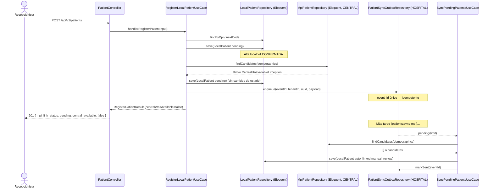
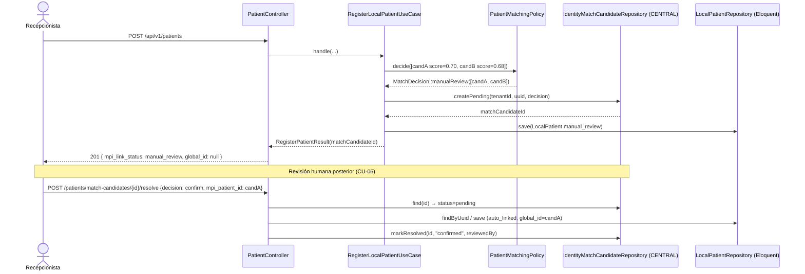

# Diagramas de secuencia — Módulo 03

## 1. Camino principal: alta con CENTRAL disponible (auto_link)

```mermaid
sequenceDiagram
    actor R as Recepcionista
    participant C as PatientController
    participant UC as RegisterLocalPatientUseCase
    participant LP as LocalPatientRepository (Eloquent)
    participant Pol as PatientMatchingPolicy
    participant MPI as MpiPatientRepository (Eloquent, CENTRAL)
    participant Link as PatientHospitalLinkRepository (CENTRAL)

    R->>C: POST /api/v1/patients
    C->>UC: handle(RegisterPatientInput)
    UC->>LP: findByDpi(tenantId, dpi)
    LP-->>UC: null (sin duplicado)
    UC->>LP: nextCode(tenantId)
    LP-->>UC: "PAC-0007"
    UC->>LP: save(LocalPatient pending)
    Note over LP: Alta local CONFIRMADA aquí,<br/>antes de tocar CENTRAL.
    UC->>MPI: findCandidates(demographics)
    MPI-->>UC: [MpiCandidate score=0.97]
    UC->>Pol: decide(candidates)
    Pol-->>UC: MatchDecision::autoLink(winner)
    UC->>Link: link(tenantId, uuid, mpiPatientId, "auto_linked")
    UC->>LP: save(LocalPatient auto_linked)
    UC-->>C: RegisterPatientResult
    C-->>R: 201 { uuid, code, mpi_link_status: auto_linked, global_id }
```

## 2. Excepción: CENTRAL no disponible (continuidad offline)



## 3. Excepción: coincidencia ambigua → revisión manual (nunca fusión automática)


