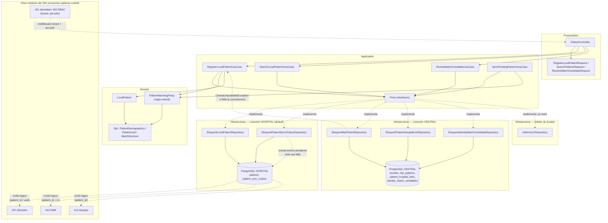

# Diagrama de componentes/capas — Módulo 03 dentro del SHI

Ubica el módulo dentro del SHI y muestra CENTRAL, HOSPITAL, contratos y el punto de falla parcial.

## Lectura del diagrama

- La línea punteada entre `EloqMpi` y `UC1` es el punto exacto donde puede ocurrir la **falla parcial**: si CENTRAL no responde, la excepción se captura en `RegisterLocalPatientUseCase`, no se propaga como error HTTP.
- `InfraFakes` no participa en producción; sustituye a los adaptadores de CENTRAL en las pruebas de aplicación (`tests/Feature/Patients/*`) para poder controlar cada rama de decisión sin infraestructura real.
- El límite `Domain` no tiene flechas de salida hacia `Infrastructure` ni hacia `Presentation`: solo `VO` (sin dependencias externas).
