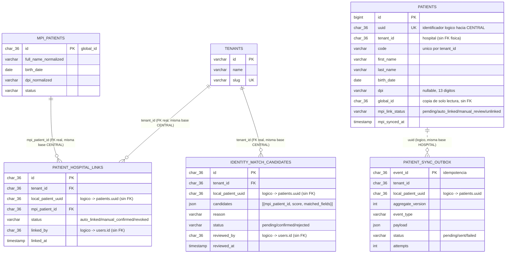

# Vista de datos (ER) — Módulo 03

Fragmento derivado del ER de 42 entidades del diagnóstico, acotado a lo que este módulo
implementa. Ver claves, restricciones e índices exactos en las migraciones
(`database/migrations/2026_08_21_*`).

## Restricciones e índices esenciales

| Tabla | Conexión | Restricción / índice | Motivo |
|---|---|---|---|
| `patients` | HOSPITAL (default) | `unique(uuid)` | Único identificador citable desde CENTRAL. |
| `patients` | HOSPITAL | `unique(tenant_id, code)` | RF-11: correlativo único por hospital, no global (ver ADR-001 decisión 2.3). |
| `patients` | HOSPITAL | `index(tenant_id, mpi_link_status)` | Listar pendientes de sincronizar por hospital. |
| `patient_sync_outbox` | HOSPITAL | `PK(event_id)` | Idempotencia del outbox. |
| `mpi_patients` | CENTRAL | `index(dpi_normalized, birth_date)` | Shortlist de candidatos antes de puntuar (evita escaneo completo). |
| `patient_hospital_links` | CENTRAL | `FK(tenant_id → tenants.id)`, `FK(mpi_patient_id → mpi_patients.id)` | Ambas tablas viven en CENTRAL: FK real válida. |
| `patient_hospital_links` | CENTRAL (PostgreSQL) | Índice único parcial `(tenant_id, local_patient_uuid) WHERE status <> 'revoked'` | Un paciente local solo puede tener un vínculo **activo** a la vez (RNF-10); se omite en SQLite (dev/tests), documentado en la migración. |
| `identity_match_candidates` | CENTRAL | `index(tenant_id, status)` | Listar pendientes de revisión por hospital. |

## Notas de propiedad de datos

- **HOSPITAL** es dueño de `patients` y `patient_sync_outbox`: escritura y verdad clínica/local.
- **CENTRAL** es dueño de `mpi_patients`, `patient_hospital_links`, `identity_match_candidates`, `tenants`: identidad de red, nunca expediente clínico.
- Ninguna fila de `mpi_patients`/`patient_hospital_links`/`identity_match_candidates` contiene datos clínicos; solo lo mínimo para desambiguar identidad (nombre, fecha de nacimiento, DPI).
