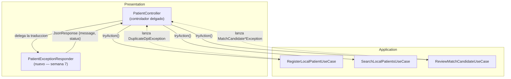
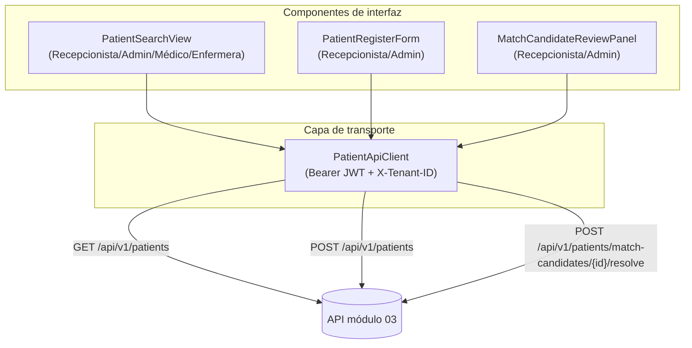

# Diseño de componentes — Módulo 03

## 1. Componentes backend (implementados)

El diagrama de componentes backend detallado ya existe desde la semana 4 y sigue vigente
sin cambios de forma: [`../diagramas/04-componentes.md`](../diagramas/04-componentes.md).
Lo único que agrega esta semana es el componente de traducción de errores, antes disuelto
dentro de `PatientController`:

**Lectura:** antes de este cambio, la flecha `Ctrl -.-> Responder` no existía como
componente propio: cada acción del controlador tenía su propio `catch` con el mapeo
excepción → código HTTP repetido. Ver el detalle en
[`REFACTOR_ANTES_DESPUES.md`](./REFACTOR_ANTES_DESPUES.md).

## 2. Componentes frontend (propuesta — no implementados en este proyecto)

Este proyecto es, hasta la fecha, una API backend (Laravel) sin cliente propio. Como parte
de la actividad de la semana 7, se propone la topología de componentes que consumiría este
contrato desde un cliente web/móvil, coherente con los roles de `actores-casos-de-uso.md`:

**Responsabilidad única por componente:**
- `PatientSearchView`: solo presenta resultados paginados; no decide reglas de negocio.
- `PatientRegisterForm`: valida formato en el cliente (espejo de `RegisterLocalPatientRequest`)
  pero la validación de autoridad es siempre la del backend.
- `MatchCandidateReviewPanel`: solo visible para `Recepcionista`/`Admin`; muestra los
  candidatos y su `score`/`reason` tal como los devuelve el backend, sin recalcular nada.
- `PatientApiClient`: único punto que conoce cabeceras (`Authorization`, `X-Tenant-ID`) y
  mapea los errores transversales de `contrato-api.md` a mensajes de UI — mismo principio
  de responsabilidad única que llevó a extraer `PatientExceptionResponder` en el backend.
