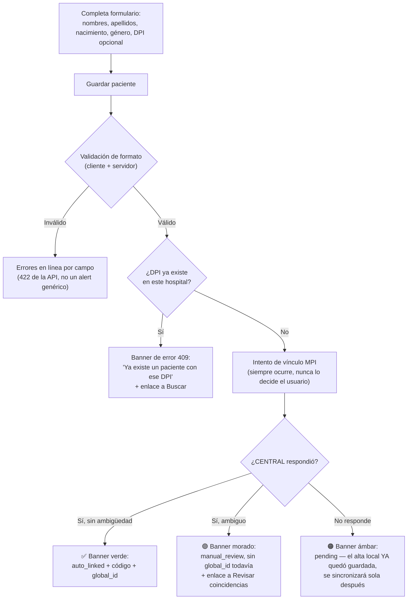
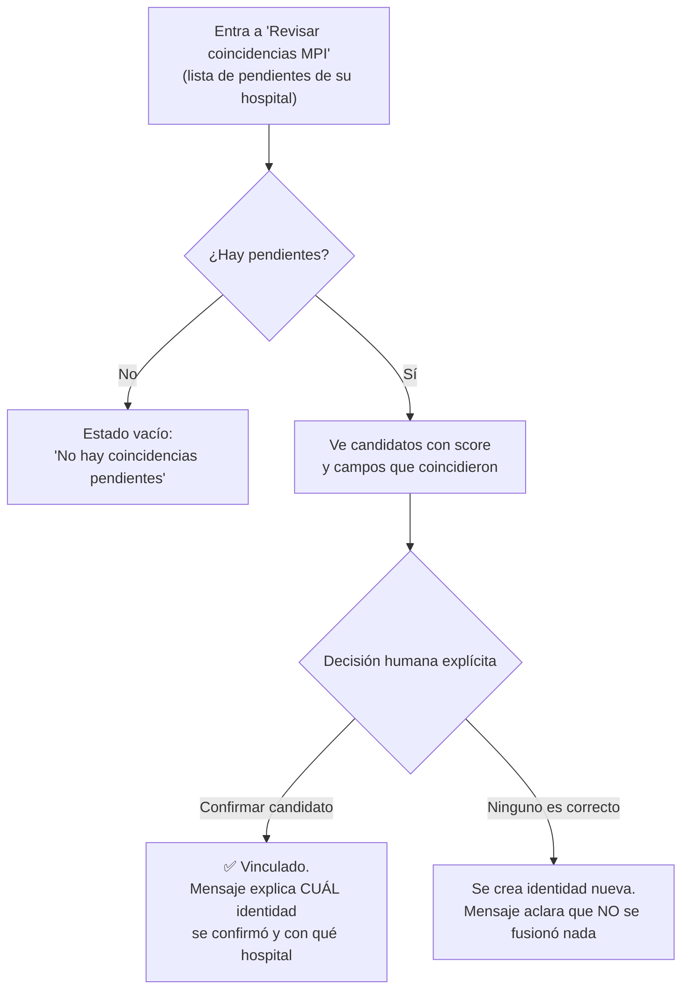

# Flujo UX por rol — Módulo Pacientes

## 1. Actores y qué ven

| Rol | Puede | No puede |
|---|---|---|
| Recepcionista, Admin | Buscar, registrar, resolver coincidencias MPI | — |
| Médico, Enfermera | Buscar y consultar | Registrar ni resolver coincidencias (la navegación ni siquiera les muestra esas dos opciones — no es solo un botón deshabilitado, es una pantalla que no existe para ellos) |

Esta diferencia se ve en vivo en el [prototipo de la semana 11](../semana-11-mockup-prototipo/README.md):
cambiar el "Rol activo" oculta "Registrar paciente" y "Revisar coincidencias MPI" del menú.

## 2. Flujo: Buscar pacientes (los 4 roles)

```mermaid
flowchart TD
    A[Entra a "Buscar pacientes"] --> B[Escribe nombre, DPI o código]
    B --> C{"¿Hay resultados?"}
    C -->|Sí| D[Tabla: nombre, código, nacimiento,\nestado MPI, global_id]
    C -->|No| E["Estado vacío:\n'Sin resultados' + sugerencia de\nrevisar el término"]
    D --> F[Selecciona un paciente]
    F --> G["(Fuera de alcance de este módulo:\nver expediente — módulo #10)"]
```

**Estados:**
- **Carga:** fila esqueleto (shimmer) mientras se espera la respuesta — nunca una pantalla en blanco.
- **Vacío:** mensaje explícito, nunca un error (RF-06: "sin coincidencias" es un resultado válido, no una falla).
- **Error de red/servidor:** banner rojo con el mensaje real devuelto por la API (nunca un texto genérico tipo "algo salió mal").

**Regla de interacción:** la búsqueda se ejecuta mientras el usuario escribe (con una espera corta antes de disparar la consulta, para no golpear la API en cada tecla), nunca requiere un botón "Buscar" aparte — igual que el prototipo.

## 3. Flujo: Registrar paciente (Recepcionista, Admin)



**Estados y ayudas:**
- El campo DPI incluye el texto de ayuda "13 dígitos, opcional" **antes** de que el usuario lo llene mal — no solo como mensaje de error después.
- Los tres desenlaces posibles (`auto_linked`, `manual_review`, `pending`) tienen su propio color y su propio texto — nunca un "Guardado" genérico que oculte cuál de los tres pasó, porque cada uno exige una acción o expectativa distinta del usuario.
- El caso `pending` es el más delicado de comunicar: debe quedar claro que **el paciente ya existe** en el hospital (no es un error, no hay que reintentar el registro), solo falta el vínculo de red.

**Regla de interacción:** el botón "Guardar paciente" se deshabilita mientras la solicitud está en curso (evita doble-envío / doble-alta accidental) y se re-habilita al recibir cualquier respuesta, éxito o error.

## 4. Flujo: Revisar coincidencia MPI (Recepcionista, Admin)



**Por qué no hay un botón "Fusionar automáticamente":** es una decisión de diseño directa de la
regla central del módulo (`docs/modulos/mod03/ADR-001-arquitectura.md`) — la UI nunca ofrece un
atajo que viole la regla de no-fusión automática. Cada candidato siempre se muestra junto a su
score y a los campos que coincidieron, para que la decisión humana sea informada, no una moneda al aire.

## 5. Mensajes de ayuda transversales

| Situación | Mensaje | Por qué |
|---|---|---|
| Formulario de registro, campo DPI vacío | "Opcional. Si el paciente no presenta DPI, continúa sin llenarlo." | Evita que el usuario piense que está obligado y abandone el registro. |
| Banner `pending` | "El paciente ya quedó registrado en tu hospital." | Es el malentendido más probable y más costoso (el usuario podría reintentar y crear un duplicado). |
| Revisión MPI, lista vacía | "Vuelve aquí cuando un registro nuevo quede en revisión manual." | Evita que el usuario piense que la pantalla está rota. |
